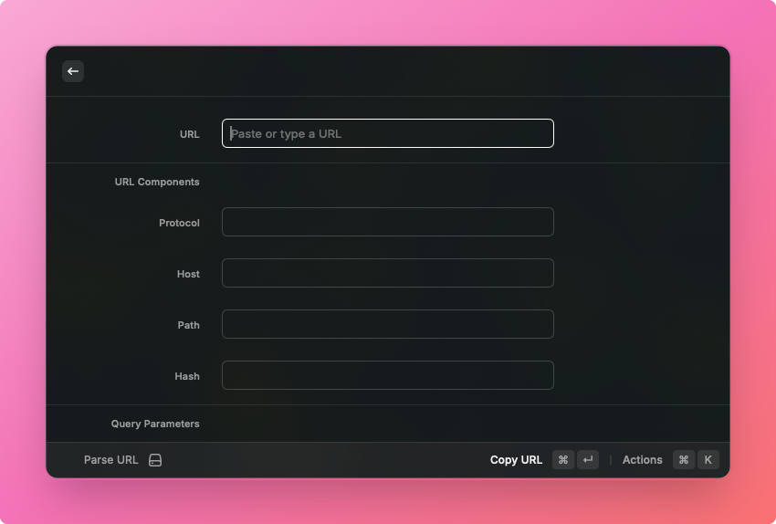

# URL Parser

A [Raycast](https://raycast.com) extension to parse, inspect, and edit URL components — auto-reads from clipboard, live preview, copy result.



## Features

- **Auto-clipboard detection** — opens with the URL already populated if your clipboard contains one
- **Live decomposition** — instantly splits any URL into protocol, host, path, query parameters, and hash
- **Editable components** — modify any part of the URL and see the reconstructed result in real time
- **Query parameter management** — add, edit, or delete individual params with stable focus tracking
- **One-action copy** — copy the final URL to clipboard with `⌘↩`
- **i18n** — English and Chinese UI, auto-detected from system locale

## Usage

1. Open Raycast and run **Parse URL**
2. Paste or type any URL into the **URL** field — the components fill in automatically
3. Edit any field (host, path, params, hash) to modify the URL
4. Add a new query parameter with `⌘N`; delete the focused one with `⌘⇧⌫`
5. Press `⌘↩` to copy the generated URL to your clipboard

## Keyboard Shortcuts

| Action                   | Shortcut |
| ------------------------ | -------- |
| Copy URL                 | `⌘↩`     |
| Add parameter            | `⌘N`     |
| Delete focused parameter | `⌘⇧⌫`    |

## Installation

Search for **URL Parser** in the Raycast Store, or install manually:

```bash
git clone https://github.com/KITTEEE/raycast-url-parser.git
cd raycast-url-parser
npm install
npm run dev
```

## Development

```bash
npm run dev        # start with hot reload
npm run build      # production build
npm test           # run tests
npm run lint       # lint
npm run fix-lint   # lint with auto-fix
```

## License

MIT
